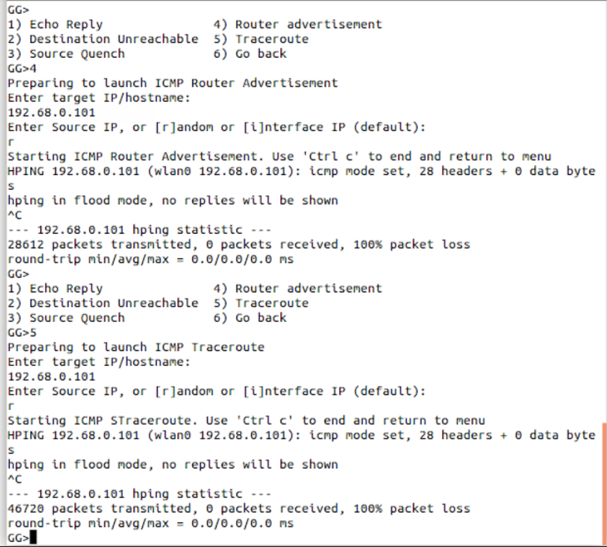

# DDOS Attack Detection and Mitigation


<!--
.,-:::::/    .,-:::::/  
,;;-'````'   ,;;-'````'   
[[[   [[[[[[/[[[   [[[[[[/
"$$c.    "$$ "$$c.    "$$ 
`Y8bo,,,o88o `Y8bo,,,o88o
`'YMUP"YMM   `'YMUP"YMM
-->

Run the Attack file in the attacker machine

Run the Mitigation file in the target machine

# Output Screenshots

## Attacker PC:

### UDP Flood


### TCP ACK Flood


### TCP RST Flood


### ICMP Echo Reply


### ICMP Destination Unreachable and Source Quench


### ICMP Router advertisement and Traceroute


## Victim PC

### Detection and Mitigation


### TCPDUMP file


### Restore Network

